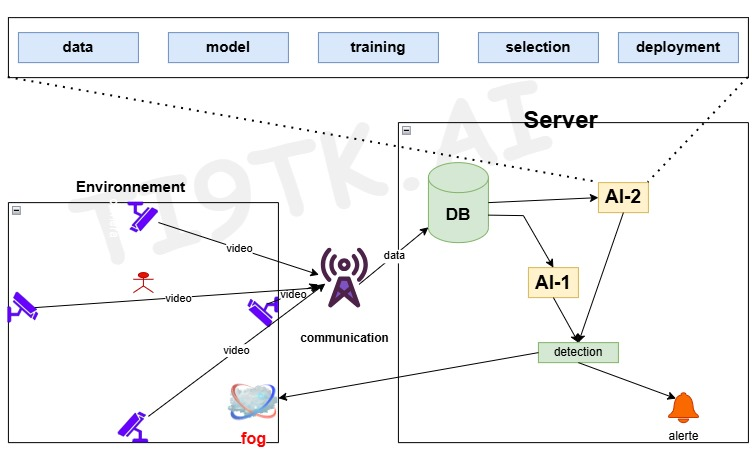

# Distributed AI-Powered IoT System for Surveillance and Behavior Detection

## Abstract

### Background and Problem Statement  
In today's security-conscious world, surveillance systems play a crucial role in ensuring public safety. However, traditional systems often lack real-time processing capabilities, scalability, and advanced AI integration. These shortcomings lead to delayed responses and an inability to handle large-scale surveillance environments effectively. This project addresses the need for a scalable, distributed, and intelligent surveillance system that can process video streams in real-time and take automated actions based on detected behaviors.


### Impact and Proposed Solution 
The proposed solution combines **IoT** with **AI** in a distributed system to provide a robust, real-time surveillance system. By using multiple worker nodes, this project ensures scalability and high efficiency in processing video streams from multiple cameras. AI algorithms, specifically object detection models, are employed to identify suspicious behaviors. If detected, the system sends alerts via WhatsApp to notify relevant stakeholders, enabling prompt action. This solution significantly improves the response time and operational efficiency of security systems.


First, you will see a series of cameras placed in the area to monitor the environment. These cameras act as video transmitters. to capture live video feed Video frames are sent to a central component called UnifiedServer

UnifiedServer plays an important role, taking incoming video data and distributing it as tasks to Multiple WorkerClients Each WorkerClient has AI processing capabilities.

Now WorkerClients These analyze video frames using AI algorithms to detect specific targeted behaviors. For example, if a system is designed to detect suspicious activities, AI will identify those activities during processing.

Once a target behavior is detected, the relevant WorkerClient sends an alert via a platform such as WhatsApp to alert the relevant team or individual in real time.

This distributed system leverages multiple workers to ensure efficient video processing. and provide immediate notification for better investigation and quick response.


### Project Outcomes and Deliverables  
- **Distributed Video Processing System**: A server-client architecture for handling multiple video streams and tasks.
- **AI Integration**: Object detection using the DETR model to analyze video frames.
- **Automated Notifications**: Integration with WhatsApp for sending real-time alerts.
- **Scalable Design**: Ability to add multiple workers for handling high workloads.
- **Codebase and Documentation**: A clean, well-documented codebase and detailed user guide for easy deployment.

---

## Instructions

### Prerequisites  
Ensure you have the following installed on your system:  
- Python 3.8 or above  
- Required Python libraries (use the `requirements.txt` file to install them)  
- OpenCV, PyWhatKit, Pynput, Transformers, and Torch  

Install all dependencies:  
```bash
pip install -r requirements.txt
```

### Directory Structure  
go to the `implementation of Our system` and open `final implementation`:
```plaintext
final implementation/
├── master.py        # Server for managing tasks and results
├── publisher.py     # Video sender script
├── worker.py     # Worker for AI processing
├── whatsapp_send.py # Script for sending WhatsApp messages
└── README.md        # Project documentation
```

---

### Step-by-Step Instructions  

#### Step 1: Start the Unified Server  
Run the **master.py** file to start the central server that will manage incoming video streams and distribute tasks to workers.  
```bash
python master.py
```  
- The terminal will display:  
  - "Socket bound to port `<PORT>`".  
  - "Unified Server started (UDP + XML-RPC)...".

#### Step 2: Start the Video Publisher  
- You can run multiple publisher from diferent Nodes (machines) just modify the `ports` and `receiver_ip` to `master ip`.
Run the **publisher.py** script to stream video from a webcam or a video file to the server.  
```bash
python publisher.py
```  
- The video frames will be sent to the server, and you'll see logs in the terminal indicating the received data.

#### Step 3: Start Worker Clients  
Run **worker_fc.py** in multiple terminals (multiple machines) to simulate a distributed system. Each worker will request tasks from the server (tasks will divied between workers), process the video frames using the DETR object detection model, and send the alerts o whatsApp if needed.  
```bash
python worker.py
```  
- Workers will output logs for each task, including detected objects and their confidence scores.  
- If a suspicious behavior is detected, a message is sent to WhatsApp automatically.

#### Step 4: Monitor System Outputs  
- Check the server logs (`master.py`) to monitor task distribution and completion.  
- View the WhatsApp messages for detected objects in real-time.  

#### Step 5: Scaling Up  
To simulate a larger system, open more terminal windows and run **worker.py** on each. This showcases the scalability of the architecture.

---

### Example Logs  

**Master Server Logs (`master.py`)**:  
```
Socket bound to port 5001  
Unified Server started (UDP + XML-RPC)...  
Task 0 added from port 5001  
Task 1 added from port 5001  
```

**Worker Logs (`worker_fc.py`)**:  
```
Worker-173306 received task 0  
Class person (0.99)  
Class backpack (0.95)  
Sending WhatsApp alert for suspicious object detected!  
```

**WhatsApp Notification Example**:  
```
Class person (0.99) detected. Immediate action recommended.  
```